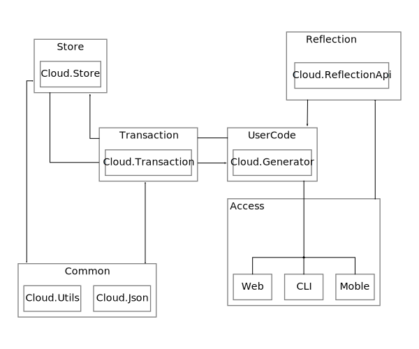

# CustomCloud 

CustomCloud is a collection of tools and libraries that allows a movable cloud, which can be set 
up on a local computer, virtual machine, or remote server.
_    

## Architectural overview

The primary goal is to make the database easy to manage under two use cases. 

__Case 1:__ _It is being developed and changes to it's structure happen frequently._
__Case 2:__ _After an idea has been developed and something new needs to be added in order to extend functionality._

The solution implemented here, is to isolate a core API then generate the backend database functionality. 

__Overview__




## [Cloud.ReflectionApi](Source/Cloud.ReflectionApi)

In order to use this system, an API should be defined with Cloud.ReflectionApi, which contains the attributes
that define how the API will be generated. The Cloud.Generator will use that API to generate both the local, and the server 
backend code. 

## [Cloud.Generator](Source/Cloud.Generator)


The user defined Api gets fed back into the generator build tool. It defines a type switch that determines the output database code.
_At the moment, only the SQLite back-ends are implemented._


The final output of the generator should be fed back into another user defined project in-order to use database types. 

The generator can be set to automatically run during build by embedding the [Cloud.Generator.targets](BuildTools/Cloud.Generator.targets) file
into a project.  

```xml
<PropertyGroup>
    <CloudGeneratorInputAssembly>$(PathToAssembly.dll)</CloudGeneratorInputAssembly>
    <CloudGeneratorOutputFile>$(Result.Filename).cs</CloudGeneratorOutputFile>
    <CloudExtraOptions>Verbose</CloudExtraOptions>
    <CloudGeneratorType>ClientSQLite</CloudGeneratorType>
    <CloudGeneratorRootNamespace>$(Namespace)</CloudGeneratorRootNamespace>
</PropertyGroup>
<Import Project="Cloud.Generator.targets" />
```

## [Cloud.Store](Source/Cloud.Store)


## [Cloud.Transaction](Source/Cloud.Transaction)

The transaction layer is a utility layer which communicates between the client and host.
The generated database code uses it to communicate with the server.

```
var book = new Book{
    Key = "SomeUniqueName",
    Author = "SomeName"
}

book.Save(); // saves locally
book.CreateTransaction().Save(); // saves externally

```

## Basic testing

In the Visual Studio solution explorer, right click on the root of the solution tree
and select Properties. Select Common Properties / Startup Project.
From the list of projects enable BookStore.Store and BookStore.FrontEnd as the projects 
to start. Then Ctrl+F5 will launch both projects for testing. 
